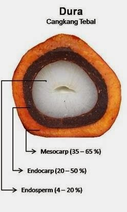
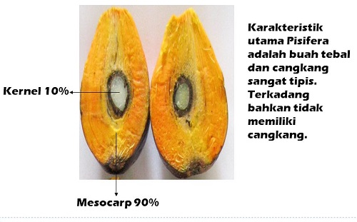
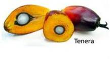
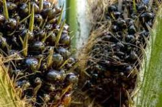
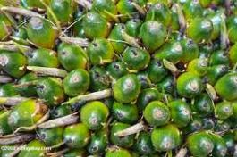
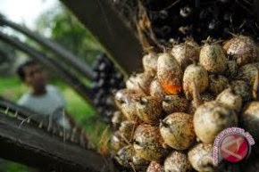
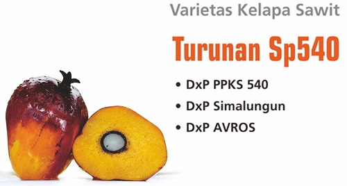
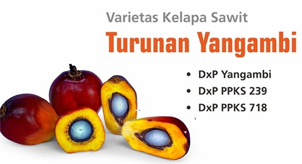
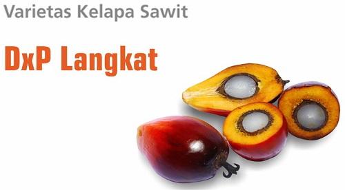

export const P = ({children}) => ( 
{children}
 );

Pada umumnya, kelapa sawit yang dibudidayakan terdiri dari 2 tipe yaitu :
* Elaeis Guineensis 
* Elaeis Oleifera. 

Elaeis Guineensis adalah tipe yang paling banyak dibudidayakan masyarakat. Kedua jenis tanaman ini memiliki keunggulannya masing-masing. 

> E. Guineensis memiliki produksi yang sangat tinggi, 
sementara E. Oleifera memiliki tinggi tanaman yang rendah. 

Itulah sebabnya banyak orang menyilangkan kedua jenis ini untuk mendapatkan tanaman sawit yang produksinya tinggi dan mudah dipanen. Saat ini, E. Oleifera mulai dibudidayakan untuk menambah keanekaragaman sumber daya genetik.

## Ketebalan Cangkang dan Daging

Jika dilihat menurut tingkat ketebalan cangkang dan daging buah, maka kelapa sawit bisa dibedakan menjadi tiga jenis.

### Kelapa Sawit Dura

Kelapa sawit dari jenis dura mempunyai cangkang yang cukup tebal sekitar 2-8 mm. Pada bagian luar cangkang hampir tidak ada serabut yang menyelimutinya. Daging buah kelapa sawit dura tidak begitu tebal dengan daging biji yang cukup besar. Jenis dura dikenal memiliki kadar kandungan minyak yang rendah dan sering dipakai sebagai induk betina ketika melakukan program pemuliaan bibit kelapa sawit.

Kelapa sawit dura bercangkang cukup tebal karena mengandung zat alela homozigot yang dominan. Kebanyakan perusahaan pengolahan kelapa sawit kurang menyukai jenis ini sebab cangkang yang tebal dapat memperpendek usia pakai mesin. Kelebihan dari kelapa sawit dura adalah ukuran buahnya relatif besar dengan kandungan minyak mencapai 18 persen setiap tandannya.

### Kelapa Sawit Pisifera

Kelapa sawit berjenis pisifera mempunyai cangkang yang sangat tipis hingga tidak bercangkang. Hal ini dikarenakan kandungan zat alela homozigot pada jenis ini bersifat resesif. Buah kelapa sawit pisifera memiliki daging yang lebih tebal daripada dura dengan daging biji yang tipis sekali.

Sayangnya, bunga betina kelapa sawit dari jenis pisifera ini bersifat steril sehingga sulit berkembang menjadi buah. Oleh sebab itu, perbanyakan jenis kelapa sawit ini hanya bisa dilakukan melalui persilangan dengan kelapa sawit dari jenis yang lainnya. Namun beberapa kelapa sawit pisifera memiliki kemampuan fertile sehingga bisa berkembang biak secara mandiri. Kelapa sawit dari pisifera ini tidak bisa digunakan sebagai tanaman komersial untuk budidaya, melainkan sebatas indukan jantan yang berkualitas unggulan.

### Kelapa Sawit Tenera

Kelapa sawit tenera merupakan kelapa sawit dari hasil persilangan antara kelapa sawit dura dan kelapa sawit pisifera. Oleh karena itu, kelapa sawit ini memiliki karakteristik yang paling bagus untuk dibudidayakan. Di antaranya tingkat ketebalan cangkang sekitar 0,5-4 mm dan mempunyai serabut yang menyelubunginya. Daging buah kelapa sawit ini juga tebal sehingga mampu menghasilkan minyak dalam jumlah yang lebih banyak.

Biasanya indukan kelapa sawit tenera berkualitas unggul berasal dari kelapa sawit dura deli dan kelapa sawit pisifera orijin. Kelapa sawit tenera mampu menghasilkan tandan buah yang lebih banyak. Ukuran diameter buah kelapa sawit dari jenis ini pun tergolong sedang, terletak di antara dura dan pisifera.

## Warna Kulit Buah
Berdasarkan warna kulit buahnya, varietas kelapa sawit dibedakan menjadi 3 yaitu :

### Nigrescens

Buah nigrescens berwarna ungu sampai hitam pada waktu muda dan berubah menjadi jingga kehitam-hitaman pada waktu matang.

### Virescens

Pada waktu muda, buah virescens berwarna hijau dan ketika matang warnanya berubah menjadi jingga kemerahan, tetapi ujungnya tetap kehijau-hijauan.

### Albescens

Pada waktu muda, buah albescens berwarna keputih-putihan, sedangkan setelah matang berubah menjadi kekuning-kuningan dan ujungnya berwarna ungu kehitam-hitaman.

## Keunggulan Sifat Tanaman

Varietas unggul kelapa sawit dihasilkan dari persilangan antara tetua yang mempunyai sifat-sifat tanaman yang baik. Tetua yang digunakan dalam proses persilangan adalah varietas Dura (sebagai induk betina) dan Psifera (sebagai induk jantan). Hasil persilangan tersebut telah menghasilkan varietas dengan kualitas yang lebih baik yaitu :

1. Varietas Dura Deli Marihat, Dura Deli D Sinumbah, Dura Dumpy Pabalu, dan Dura Deli G Bayu
2. Varietas Pisifera D Sinumbah, Pisifera Marihat, Pisifera SP 540 T, Pisifera La Me, dan Pisifera Yangabi
3. Varietas DxP PPKS 540, DxP PPKS 718, DxP PPKS 239, DxP Simalungun, DxP Langkat, DX La Me, DxP Avros dan DxP Yangambi. Varietas-varietas ini adalah varietas unggul kelapa sawit yang tersedia di PPKS (Pusat Penelitian Kelapa Sawit). 

Keunggulan dan ciri masing-masing varietas adalah sebagai berikut :

### DxP PPKS 540, DxP Simalungun dan DxP Avros

Ketiga varietas unggul kelapa sawit ini termasuk dalam kelompok SP540, yaitu varietas-varietas kelapa sawit yang dihasilkan dari tetua Pisifera turunan SP540 murni yang hanya dimiliki oleh PPKS. 

Karakter unggulan dari kelompok varietas SP540 ini adalah quick starter dan persentase mesokarp per buah yang cukup tinggi. Dengan adaptasi yang cukup luas, varietas ini dapat ditanam diberbagai tipe lahan baik wilayah datar maupun bergelombang. 

### DxP Yangambi, DxP PPKS 239, dan DxP PPKS 718

Ketiga varietas unggul kelapa sawit ini termasuk dalam kelompok Yangambi, yaitu populasi kelapa sawit asal Afrika yang banyak digunakan sebagai tetua Pisifera sumber benih unggul. 

Secara umum kelompok ini memiliki keunggulan pada bobot tandan yang relatif besar dan memiliki kandungan rendemen minyak dan mesokarp yang tinggi, jauh lebih tinggi dari varietas kelompok lainnya.

Varietas DxP PPKS 239, selain memiliki tandan yang besar juga memiliki potensi produksi CPO dan PKO yang lebih tinggi dibandingkan varietas lainnya dari kelompok Yangambi. Varietas ini cocok dikembangkan untuk industri pangan maupun non pangan.

###  DxP Langkat

DxP Langkat merupakan varietas pertama yang dirakit PPKS dari hasil rekombinasi tetua-tetua terbaik beberapa populasi pisifera. Tetua pisifera hasil rekombinasi antara pisifera SP540, Yangambi, dan Marihat yang disilangkan dengan Dura Deli terbaik menghasilkan varietas dengan karakter unggul rachis yang relatif pendek (compact palm) dan potensi CPO hingga 8,3 ton/ha/tahun. Selain cocok ditanam di areal bergelombang dan berbukit, varietas ini juga dapat mulai berbuah pada umur 22 bulan setelah tanam.

